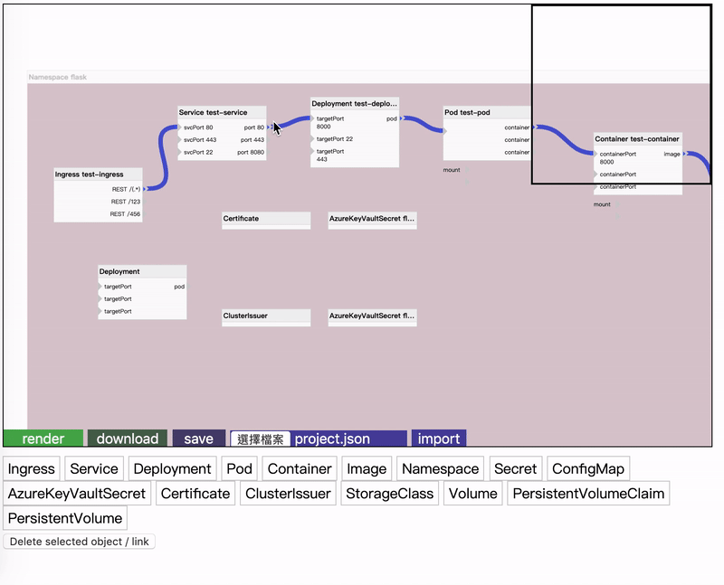
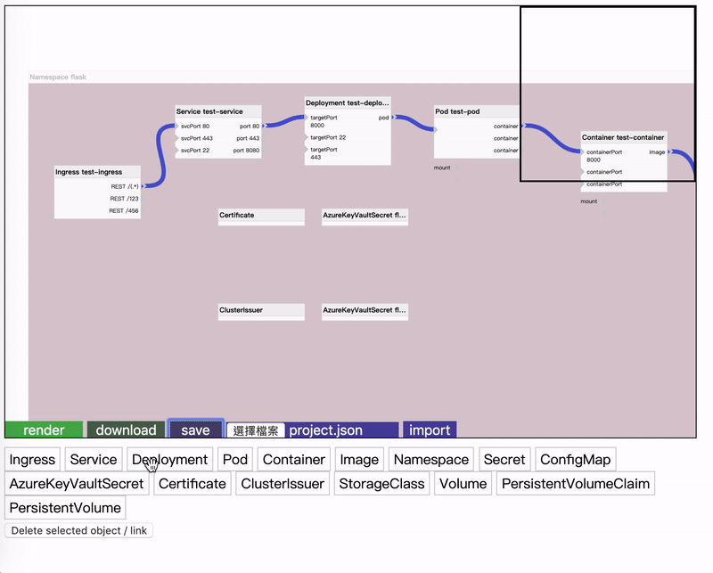
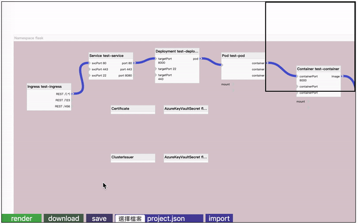
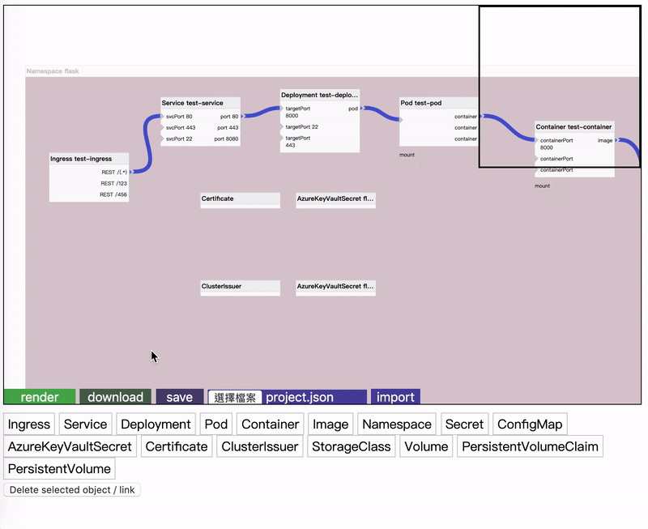
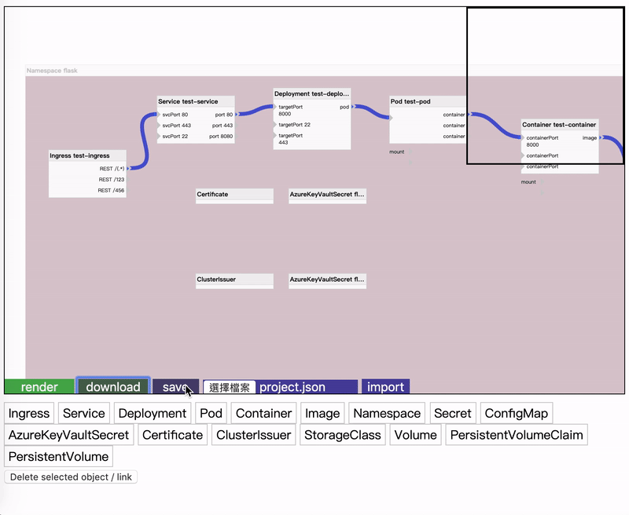
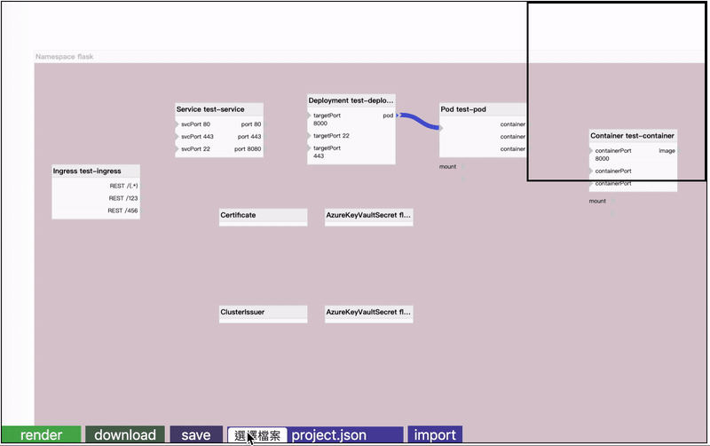

### To begin with ...

In the past two month, I started learning kubernetes. And I make a basic graphical user interface for k8s deployment, it's just like helm filling `value.yaml`. I'll add some my knowing about kubernetes and some instruction to operate with this deployment tool. By doing so, not only will I try to learn more about every element in kubernetes, I'll refine the tool when I try to deploy using this tool. 

### Usage

Build on flowchart.js, simply drag and drop, connect operators.

#### connect

#### drag and drop

#### render yaml file

#### download yaml file

#### save project

#### import saved project

